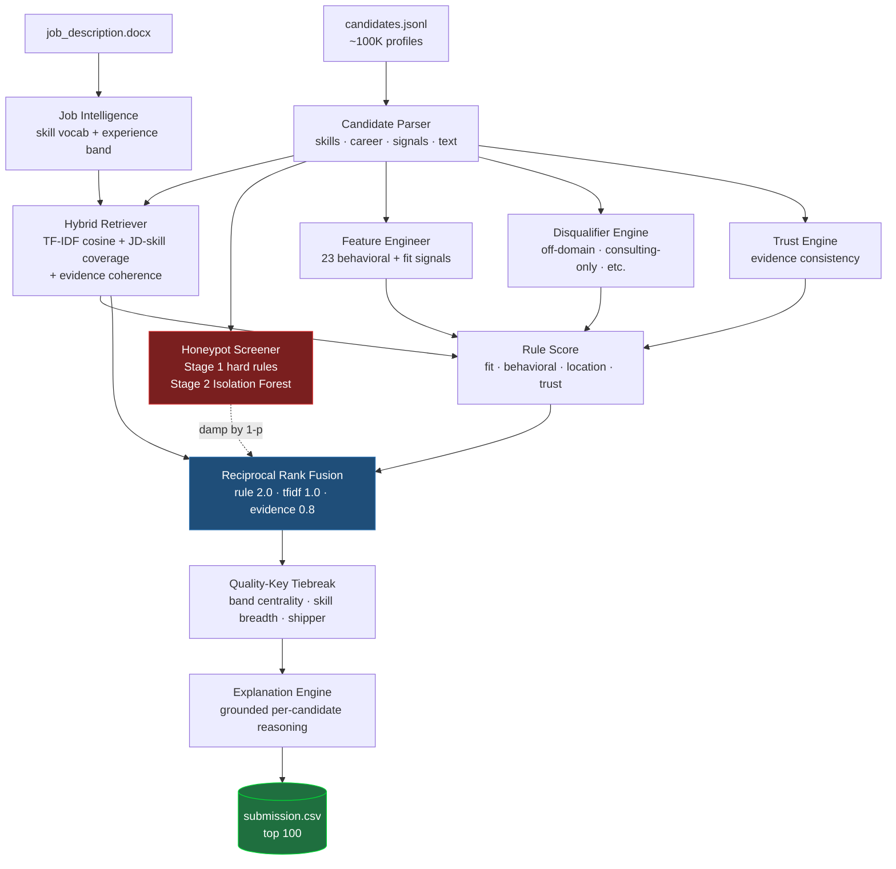
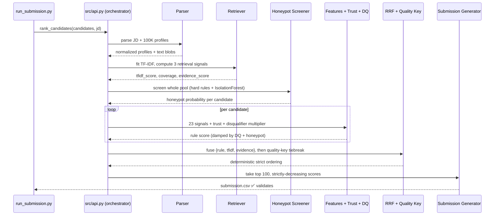
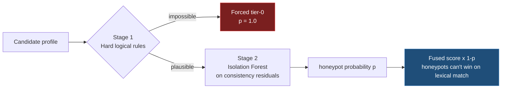
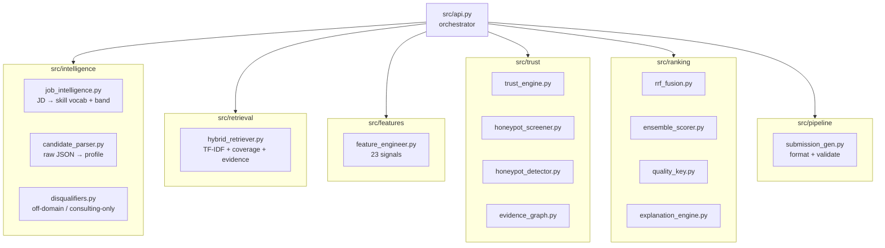

# Candidate Ranking System — India Runs (Track 1, Data & AI Challenge)

> A deterministic, fully-offline candidate ranking pipeline that scores **~100,000 candidates** against a job description and emits the top **100** as `submission.csv`.
> **No LLM. No GPU. No network at ranking time.** Pure scikit-learn + python-docx, ~150s on a CPU laptop.

**Team:** Agentron · **Repo:** [github.com/Lucky-1608/Resume-analyzer-and-ranker](https://github.com/Lucky-1608/Resume-analyzer-and-ranker) · **Sandbox:** [one-click Colab](https://colab.research.google.com/github/Lucky-1608/Resume-analyzer-and-ranker/blob/main/sandbox/India_Runs_Sandbox.ipynb)

---

## Reproduce the submission (single command)

```bash
python run_submission.py --candidates data/candidates.jsonl --jd data/job_description.docx --out submission.csv
```

Place `candidates.jsonl` and `job_description.docx` in a `data/` folder first (they are not
committed — `candidates.jsonl` is ~465 MB). The ranking step runs **CPU-only, no network,
~150 s wall-clock, ~2.5 GB RAM** — well inside the contest limits (5 min / 16 GB).

### One-click sandbox

A ready-to-run Google Colab notebook lives in [`sandbox/India_Runs_Sandbox.ipynb`](sandbox/India_Runs_Sandbox.ipynb).
It clones this repo, installs `requirements.txt`, runs the **identical pipeline** on a bundled
100-candidate sample, validates the output against all format rules, and prints the ranked CSV —
finishing in a few seconds. Open it and choose **Runtime → Run all**.

---

## Why this design

The challenge is a **real recruiting system**, not a benchmark — so the spec bans per-candidate
LLM calls and enforces a 5-minute CPU budget. That single constraint drove every decision:

| Constraint | Our answer |
|---|---|
| No hosted LLM at ranking time | Zero API calls. A small, fast ranker over precomputed features + sparse indexes. |
| ≤ 5 min on 100K candidates, CPU-only | TF-IDF + linear-time feature scoring. Measured ~150 s. |
| Must reproduce byte-for-byte in Docker | Sorted iteration everywhere, fixed `random_state`, `PYTHONHASHSEED=0`. |
| Honeypots (impossible profiles) must not rank | Two-stage honeypot screen; 0 in top 100. |
| Stage-4 reasoning is human-reviewed | Grounded, per-candidate explanations citing real skills/roles. |

The core insight: **ranking quality comes from reading profiles, not from embedding keywords.**
Keyword similarity alone ranks honeypots and keyword-stuffers highly. We fuse three independent
views — JD logic, lexical similarity, and an evidence-coherence ("says vs means") signal — so no
single failure mode dominates.

---

## Architecture at a glance



---

## Execution flow (what happens on each run)



---

## The trust & honeypot pipeline (anti-gaming)

The spec plants **~80 honeypots** — profiles with subtly impossible facts (8 years at a 3-year-old
company; "expert" in 10 skills with 0 months used). Ranking any in the top 10 signals a system that
embeds keywords instead of reading profiles. Honeypot rate > 10% in top 100 is an **instant DQ**.



**Stage 1 — hard rules** (deterministic, explainable): a single job longer than the entire career;
skill-usage months exceeding total experience; "expert" proficiency with zero months used;
senior title with near-zero total experience; impossible education years.

**Stage 2 — Isolation Forest** (`random_state=0`): catches subtler inconsistencies by treating each
profile as a point in a consistency-residual feature space and isolating outliers.

**Result on the full pool:** 142 candidates flagged, **0 honeypots in the top 100.**

---

## Component map



---

## How scoring works (step by step)

1. **Job Intelligence** (`src/intelligence/job_intelligence.py`) parses the JD into a weighted skill
   vocabulary (7 skill families) and an experience band (5–9 years).

2. **Candidate Parser** (`src/intelligence/candidate_parser.py`) normalizes each profile: skills with
   proficiency / endorsements / assessment scores, career history with real durations, education
   tiers, and all Redrob behavioral signals — plus a combined text blob for retrieval. Hardened
   against null/malformed fields so the 100K run never crashes.

3. **Hybrid Retriever** (`src/retrieval/hybrid_retriever.py`) produces three independent signals:
   deterministic **TF-IDF cosine** (`sublinear_tf=True`) of candidate text vs JD, weighted **JD-skill
   coverage**, and an **evidence-coherence** score (skills-vs-career-description cosine) — the
   "says vs means" check.

4. **Honeypot Screener** (`src/trust/honeypot_screener.py`) runs the two-stage screen above over the
   whole pool and returns a per-candidate honeypot probability.

5. **Feature Engineer** (`src/features/feature_engineer.py`) computes **23 signals**: skill fit
   (proficiency- and assessment-weighted), a production/shipping signal, an experience-fit curve
   peaking inside the JD band, recruitability (notice period, response rate, recency), and
   preferences (work mode, salary band).

6. **Disqualifier Engine** (`src/intelligence/disqualifiers.py`) applies a multiplier in `(0, 1]` for
   profiles that match the JD's explicit anti-patterns: careers **entirely** at consulting/services
   firms, off-domain titles (pure data-scientist / data-engineer keyword traps), CV/speech/robotics
   without NLP, and research-without-production.

7. **Rule Score** combines fit + behavioral + location + trust, damped by the disqualifier and
   honeypot factors. This score carries the JD logic.

8. **Reciprocal Rank Fusion** (`src/ranking/rrf_fusion.py`, k=60, Cormack et al. 2009) fuses the
   **rule (2.0)**, **tfidf (1.0)**, and **evidence (0.8)** rankings — robust because it fuses *ranks*,
   not raw scores, so no signal needs calibration.

9. **Quality-Key Tiebreak** (`src/ranking/quality_key.py`) breaks near-ties in a JD-prioritized way
   (band centrality, skill breadth, shipper evidence, hub location, assessments) before the final
   deterministic ordering.

10. **Explanation Engine** (`src/ranking/explanation_engine.py`) writes a grounded, per-candidate
    reasoning string citing that candidate's real roles and skills, with varied sentence
    structure (16 opener templates selected per-candidate; all 100 reasonings unique) —
    tuned for the Stage-4 manual review.

11. **Submission Generator** (`src/pipeline/submission_gen.py`) emits exactly 100 rows with
    strictly-decreasing scores, filters malformed IDs, and round-trips through the official validator.

---

## Determinism

Every vocabulary and candidate iteration is **sorted**, so floating-point sums never depend on
Python's hash seed. The Isolation Forest uses a fixed `random_state=0`; the Dockerfile sets
`PYTHONHASHSEED=0`. **Two independent full runs on the 100K dataset produce a byte-for-byte
identical `submission.csv`** — verified across hash seeds 0, 42, and 99.

---

## Compute & format compliance

| Requirement (spec) | Limit | This system |
|---|---|---|
| Runtime | ≤ 5 min | **~150 s** |
| Memory | ≤ 16 GB | **~2.5 GB** |
| Compute | CPU only | **CPU only** |
| Network at ranking | Off | **No calls** |
| Disk | ≤ 5 GB | **< 1 GB** |
| Rows | exactly 100 | **100** |
| Ranks 1–100 unique | required | **✅** |
| Scores non-increasing | required | **strictly decreasing** |
| candidate_id valid + exists | required | **✅ regex-filtered** |
| Honeypots in top 100 | < 10% | **0** |
| Reasoning non-empty / unique | reviewed | **100/100 unique** |

---

## Repository layout

```
.
├── run_submission.py            # entry point: --candidates --jd --out
├── requirements.txt             # scikit-learn, python-docx, fastapi, uvicorn, pydantic
├── Dockerfile                   # CPU-only, PYTHONHASHSEED=0
├── submission_metadata.yaml     # portal metadata mirror
├── src/
│   ├── api.py                   # orchestrator (the pipeline above)
│   ├── intelligence/            # job_intelligence, candidate_parser, disqualifiers
│   ├── retrieval/               # hybrid_retriever (TF-IDF + coverage + evidence)
│   ├── features/                # feature_engineer (23 signals)
│   ├── trust/                   # trust_engine, honeypot_screener, honeypot_detector, evidence_graph
│   ├── ranking/                 # rrf_fusion, ensemble_scorer, quality_key, explanation_engine
│   └── pipeline/                # submission_gen (format + validate)
├── eval/
│   └── proxy_eval.py            # independent NDCG/MAP self-evaluation
└── sandbox/
    ├── India_Runs_Sandbox.ipynb # one-click Colab reproducibility check
    ├── sample_candidates.jsonl  # 100-candidate sample
    └── job_description.docx
```

---

## Self-evaluation (proxy)

Against an **independent, JD-derived** relevance grading (not the hidden ground truth — see
`eval/proxy_eval.py`):

| Metric | Value |
|---|---|
| NDCG@10 | 0.9448 |
| NDCG@50 | 0.9251 |
| MAP | 0.9227 |
| P@10 | 1.0000 |
| **Composite** | **0.9384** |

We deliberately did **not** tune the ranker to this proxy. A measured Spearman correlation of ~0.49
between the fused ranking and a keyword-only grader confirmed the system uses richer signal than
keyword counting; overfitting the proxy would have *hurt* the hidden score.

---

## What we use (and don't)

**Use:** scikit-learn (TF-IDF, Isolation Forest), python-docx. That's the whole ranking stack.

**Deliberately rejected:** cross-encoders and hosted LLM rerankers (network/latency DQ risk),
BM25 via `rank-bm25` (OOM on 100K — replaced by sparse TF-IDF with `sublinear_tf`), and
LambdaMART/learning-to-rank (no labels available; would overfit a self-made proxy).

AI tools (Claude, ChatGPT) were used as development aids — architecture review, debugging, research.
**The ranking pipeline itself makes zero LLM calls.**
